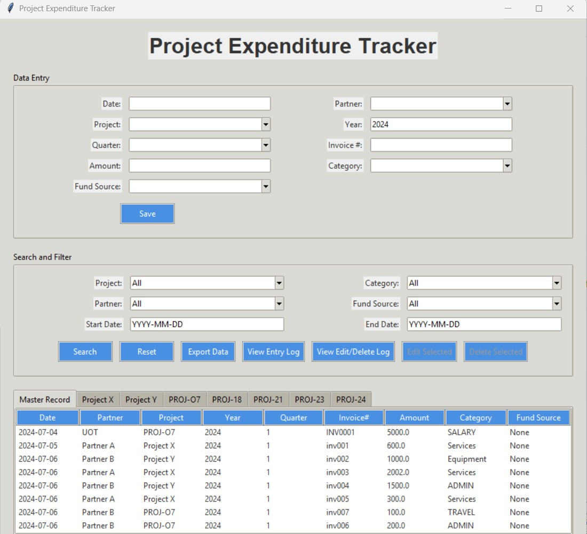
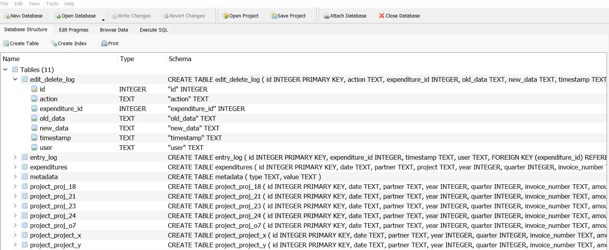
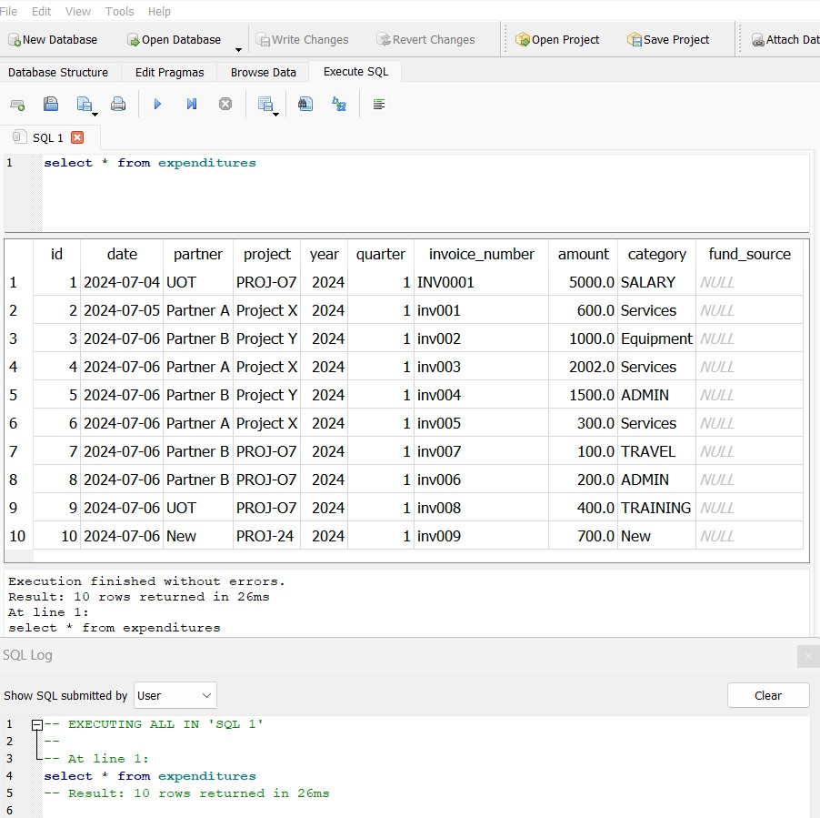
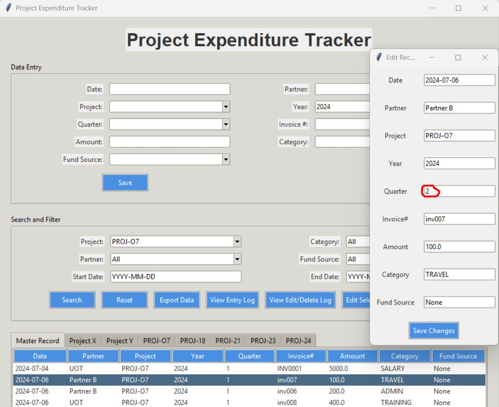
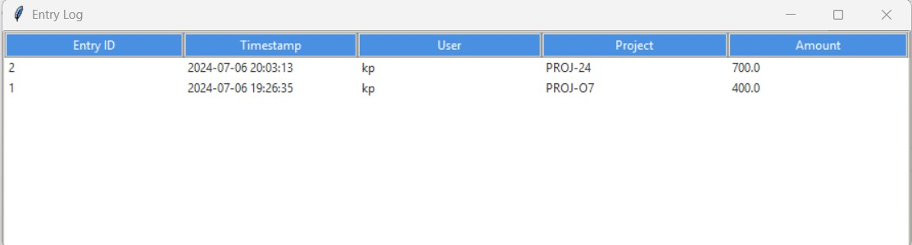
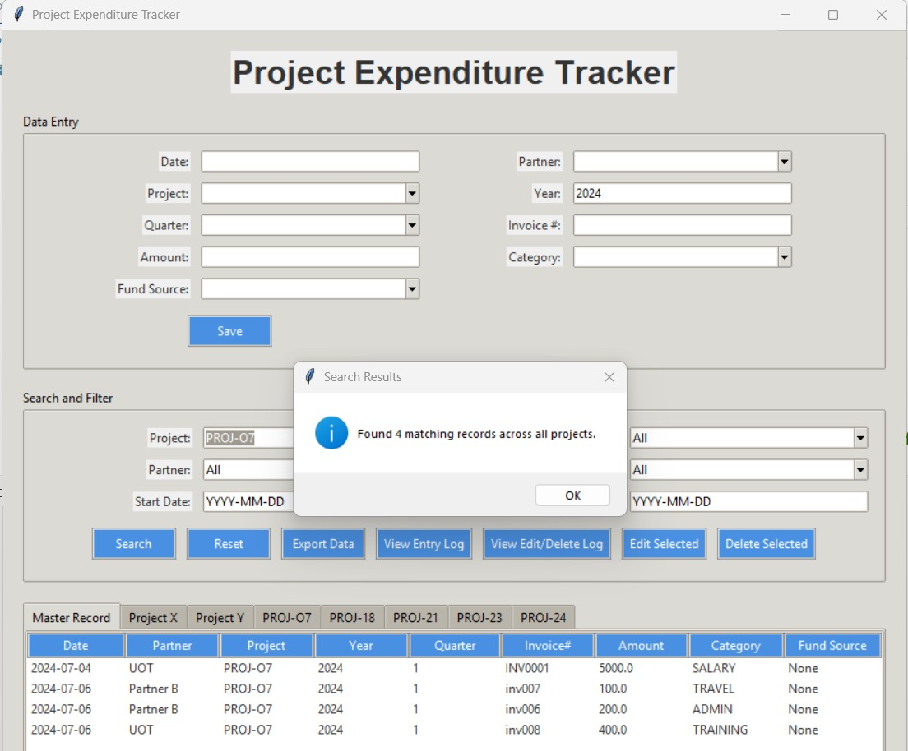

## 👋 Hello, Welcome to my application 'Project Expense Tracker' !

<h3 align="center">This GUI intends to record and track project based expenditure over time and reconcile the records with proper control of database & administration backup.</h3>

  

Please scroll down to know more about this project

[Explore other projects »](https://github.com/paudel7?tab=repositories)

  <a href="your-demo-link">View Demo</a>
  ·
  <a href="your-bug-report-link">Report Bug</a>
  ·
  <a href="your-feature-request-link">Request Feature</a>

  
  
  

## 🎯 About The Project

  img src="./assets/app-Str.png" alt="Project Structure" width="600">

This project is an application that will help project finance professionals manage their expenditures in recording and tracking with all administrative control. This might be ideal for projects which are run in partnership fundign and implementation where portion of the expenditure is allocated to different fund sources.

## ✨ Demo-Preview

Here are some demo we can get in this project:

 

 

  
 

  
 

  
 
 

## ⚡ Workflow

  

[Workflow description 1]

## 📚 References

  

[Reference description 1]

## 📋 Table of Contents
- [Demo-Preview](#-demo-preview)
- [Workflow](#-workflow)
- [References](#-references)
- [Installation](#-installation)
- [Usage](#-usage)
- [Contribute](#-contribute)
- [License](#-license)
- [Contact](#-contact)
- [Acknowledgments](#-acknowledgments)

## 🚀 Installation

Please follow the steps in the instruction text file.

(<a href="#-table-of-contents">back to top</a>)

## 💡 Usage

For more usage info, just take a look at the instruction text file.

(<a href="#-table-of-contents">back to top</a>)

## 🤝 Contribute

Contributions are what make the open source community such an amazing place to learn, inspire, and create. Any contributions you make are **greatly appreciated**.

1. Fork the Project
2. Create your Feature Branch (`git checkout -b feature/[FeatureName]`)
3. Commit your Changes (`git commit -m '[Your Commit Message]'`)
4. Push to the Branch (`git push origin feature/[FeatureName]`)
5. Open a Pull Request

(<a href="#-table-of-contents">back to top</a>)

## 📝 License

Distributed under the [License Type] License. See `LICENSE.txt` for more information.

(<a href="#-table-of-contents">back to top</a>)

## 📫 Contact

  
  
  

## 🛠️ Languages and Tools

  <!-- Add your tech stack icons here -->
  
  <!-- Add more tools as needed -->

## 🙏 Acknowledgments

Here is a list of some of the resources I found helpful and would like to give credit to:

* [Resource 1](link-to-resource-1)

(<a href="#-table-of-contents">back to top</a>)

---

If you found this project helpful, please consider giving it a ⭐!

